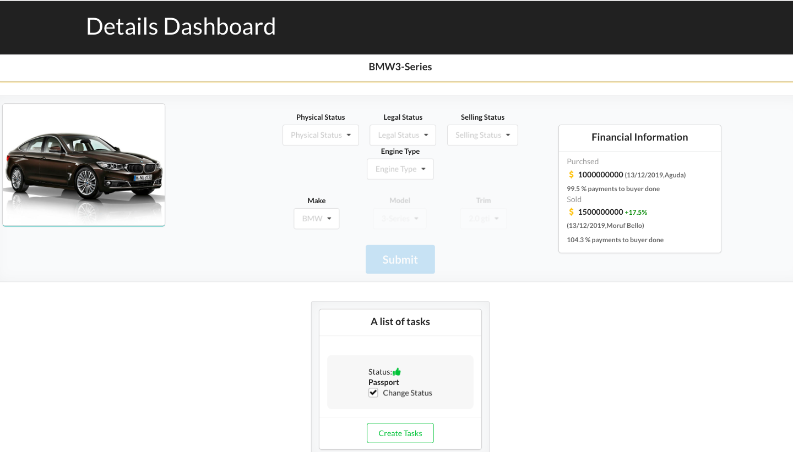

## Basic Overview

dashboard-gql Built using React, Redux, Webpack and leverages the power of a Graphql based backend

- GraphQl queries are bound to the standard react, redux setup.

- The major difference is in the way the data is fetched on the client side compared to the standard REST API calls

This project is hosted at [https://heuristic-brown-ebb506.netlify.com/](https://heuristic-brown-ebb506.netlify.com/)

## Available Scripts

In the project directory, you can run:

### `npm install --save`

installs dependencies  

### `npm install --save-dev`

installs dev-dependencies  

### `npm start`

Runs the app in the development mode. 
Open [http://localhost:3001](http://localhost:3001) to view it in the browser.

### `npm run test`

Launches the test runner.

### `npm run build`

Builds the app for production to the `dist` folder

## Screens

